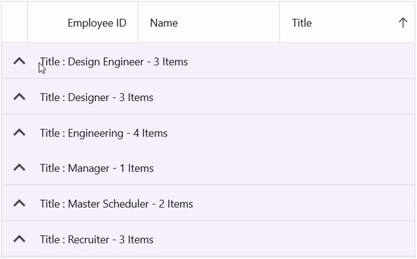

# How to keep any one specific group alone in the expanded state in MAUI DataGrid?

The [.NET MAUI DataGrid](https://www.syncfusion.com/maui-controls/maui-datagrid) allows you to keep only one group expanded while the remaining groups stay collapsed.

#### XAML
We wire up the group expanding event in the datagrid.
```XML
<syncfusion:SfDataGrid x:Name="dataGrid"
                    x:DataType="local:EmployeeViewModel"
                    AllowGroupExpandCollapse="True"
                    GroupExpanding="dataGrid_GroupExpanding"
                    AutoExpandGroups="False"
                    ItemsSource="{Binding Employees}">

    <syncfusion:SfDataGrid.GroupColumnDescriptions>
        <syncfusion:GroupColumnDescription ColumnName="Title" />
    </syncfusion:SfDataGrid.GroupColumnDescriptions>
</syncfusion:SfDataGrid>
```

#### C#
We retrieve the group that is about to expand from the event arguments. We then check whether there is no currently expanded group or if the group to be expanded is different from the currently expanded group. Next, we iterate through all groups in the dataGrid. For each group that is not the one currently expanding, we collapse it. After that, we set the local variable to the group that is currently expanding. Finally, we explicitly expand the group.

```C#
private Group? expandedGroup;

private void dataGrid_GroupExpanding(object sender, DataGridColumnGroupChangingEventArgs e)
{
    var group = e.Group;
    if (expandedGroup == null || group!.Key != expandedGroup.Key)
    {
        foreach (Group otherGroup in dataGrid.View!.Groups)
        {
            if (group!.Key != otherGroup.Key)
            {
                dataGrid.CollapseGroup(otherGroup);
            }
        }
        expandedGroup = group!;
        dataGrid.ExpandGroup((Group)expandedGroup!);
    }
}
```



[View sample in GitHub](https://github.com/SyncfusionExamples/How-to-keep-any-one-specific-group-alone-in-the-expanded-state-in-MAUI-DataGrid)

Take a moment to pursue this [documentation](https://help.syncfusion.com/maui/datagrid/overview), where you can find more about Syncfusion .NET MAUI DataGrid (SfDataGrid) with code examples.
Please refer to this [link](https://www.syncfusion.com/maui-controls/maui-datagrid) to learn about the essential features of Syncfusion .NET MAUI DataGrid(SfDataGrid).

### Conclusion
I hope you enjoyed learning about how to keep any one specific group alone in the expanded state in MAUI DataGrid.

You can refer to our [.NET MAUI DataGrid's feature tour](https://www.syncfusion.com/maui-controls/maui-datagrid) page to know about its other groundbreaking feature representations. You can also explore our .NET MAUI DataGrid Documentation to understand how to present and manipulate data.
For current customers, you can check out our .NET MAUI components from the [License and Downloads](https://www.syncfusion.com/account/downloads) page. If you are new to Syncfusion, you can try our 30-day free trial to check out our .NET MAUI DataGrid and other .NET MAUI components.
If you have any queries or require clarifications, please let us know in comments below. You can also contact us through our [support forums](https://www.syncfusion.com/forums), [Direct-Trac](https://support.syncfusion.com/account/login?ReturnUrl=%2Faccount%2Fconnect%2Fauthorize%2Fcallback%3Fclient_id%3Dc54e52f3eb3cde0c3f20474f1bc179ed%26redirect_uri%3Dhttps%253A%252F%252Fsupport.syncfusion.com%252Fagent%252Flogincallback%26response_type%3Dcode%26scope%3Dopenid%2520profile%2520agent.api%2520integration.api%2520offline_access%2520kb.api%26state%3D8db41f98953a4d9ba40407b150ad4cf2%26code_challenge%3DvwHoT64z2h21eP_A9g7JWtr3vp3iPrvSjfh5hN5C7IE%26code_challenge_method%3DS256%26response_mode%3Dquery) or [feedback portal](https://www.syncfusion.com/feedback/maui?control=sfdatagrid). We are always happy to assist you!